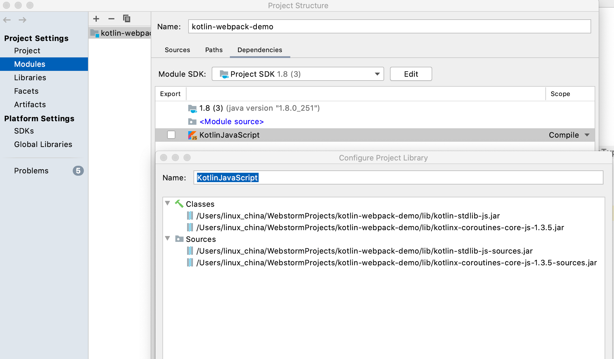

Kotlin/JS Webpack Demo
======================

Use webpack to compile Kotlin files

# Setup

Please use IntelliJ IDEA to open the project.

# dukat

Converter of TypeScript definition files to Kotlin declarations

```
$ dukat -p axios -m axios  index.d.ts
```

# Kotlin Coroutines support

* Add lib/kotlinx-coroutines-core-js-1.3.5.jar as module dependency in IDEA to enable code completion.
* Add kotlinx-coroutines-core as dependency in package.json
* Enable librariesAutoLookup for KotlinWebpackPlugin in webpack.config.js



# Features

Mix Javascript, TypeScript and Kotlin together by using Webpack.

# References

* Kotlin/JS: https://kotlinlang.org/docs/reference/js-project-setup.html
* kotlin-webpack-plugin: Compile Kotlin files to JavaScript using webpack https://github.com/JetBrains/create-react-kotlin-app/tree/master/packages/kotlin-webpack-plugin
* Top 1000 most depended-upon packages: https://gist.github.com/anvaka/8e8fa57c7ee1350e3491
